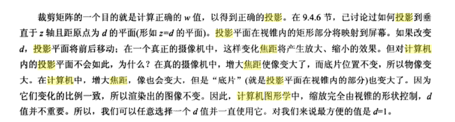
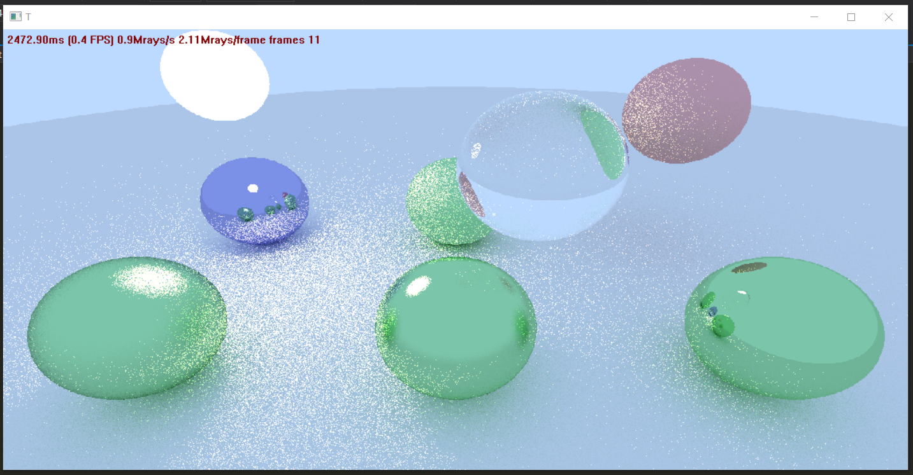
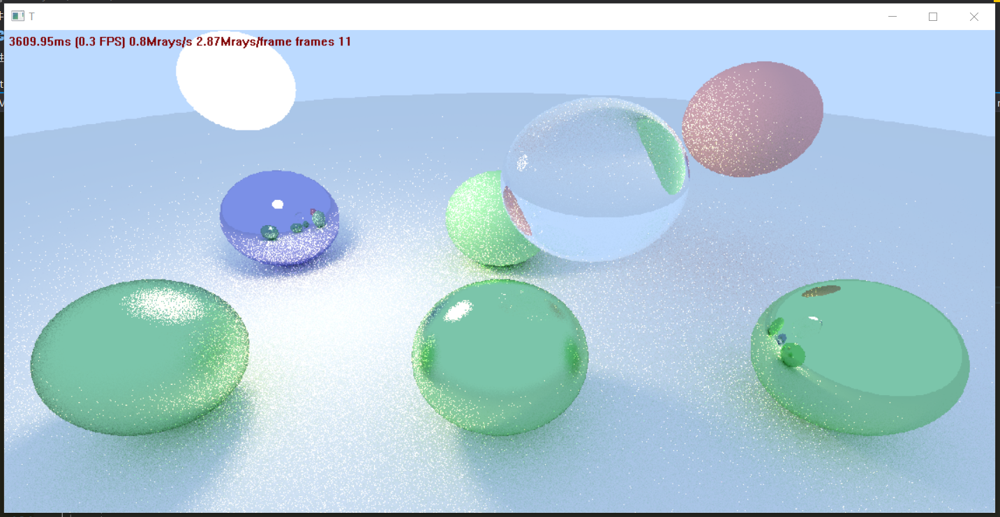

# CPU实现

---

## Code Walkthrough

[第一篇教程](http://aras-p.info/blog/2018/03/28/Daily-Pathtracer-Part-1-Initial-C-/)初始C++代码自上而下详解。

### 准备工作

`maths.h`文件中自定义了需要用到的结构体和函数。

`float3`既可表示颜色又可表示点/向量的坐标，并且实现了运算符重载。

`Ray`表示射线，包含射线起点和射线方向。

`Hit`表示射线和圆的交点，包含交点位置，交点法向量，射线起点到交点的距离。

`Sphere`球。

#### Camera

`Camera`相机，变量除了基本的坐标轴外（场景采用右手系，相机也是，z轴指向屏幕外），还有`lowerLeftCorner`投影平面左下角， `horizontalVec, verticalVec`用于方便将屏幕坐标转换为视平面坐标。

`focusDist`是视点到焦平面的距离，如下图所说，由于是透视投影，这个距离越大，焦平面就越大。因此这个距离除非非常小导致焦平面过小，对遍历屏幕获取的射线不会改变方向，没有影响。



 `lensRadius`是光圈半径，观察点origin在光圈内取随机偏移，光圈大小用于控制模糊范围。

构造函数的参数和OpenGL用到的类似：

```cpp
// 观察起点，观察终点，坐标系单位朝上向量，纵向fov，屏幕宽高比，光圈直径，焦距
Camera(const float3& lookFrom, const float3& lookAt, const float3& vup, float vfov, float aspect, float aperture, float focusDist);
```

用屏幕坐标获取对应光线的GetRay函数：

```cpp
// s和t表示屏幕上某像素点坐标宽度和高度占的比例，用于得到焦平面的对应像素点
Ray GetRay(float s, float t, uint32_t& state) const;
```

`reflect()`求反射向量的方向。

`refract()`求反射向量的方向，入射向量v，法向量n，出射向量都要是单位向量，nint为折射率（入射材质折射率/折射材质折射率）。

一套获取随机数的函数。

数学类的准备工作完成后，我们从上到下来进行代码walkthrough。

### GDI

第一个步骤是绘制窗口。由于是CPU实现，这里使用的是GDI库，它是windows的通用图形库，用于在窗口程序中绘制，和DirectX的应用场景不同。需要用到win32 API，所有传统windows的窗口都要用到这个win32 API，只是DirectX或OpenGL把这些封装起来了，实际上它们绘制窗口都要调用这些函数。[GDI官方文档](https://docs.microsoft.com/zh-cn/windows/desktop/gdi/windows-gdi)，[Win32官方入门教程](https://docs.microsoft.com/zh-cn/windows/desktop/LearnWin32/your-first-windows-program)。

`main.cpp`做的就是调用GDI将backbuffer绘制到屏幕上，使用了双缓冲。

### enkiTS

现在知道如何绘制backbuffer了，接下来是绘制buffer的函数`DrawTest()`和它调用的`TraceRowJob()`。这里用到了一个多线程库enkiTS。

#### enkiTS安装

把enkiTS/src目录下的文件包含到项目代码中；

把`D:\enkiTS\enkiTS\enkiTS.lib`包含到`项目-属性-链接器-输入-附加依赖项`。

#### 使用

用法参考github中的examples，`src/enkiTS-Helloworld`是使用demo。 其中`m_SetSize`是一个隐含变量，默认为1，为这个变量赋值相当于在外部给range赋值再执行ExecuteRange，而内部利用m_SetSize调用ExecuteRange是再次分为多线程并行的，每次分配的range不确定。

这里将屏幕每一行分配给线程执行，TraceRowJob做的就是遍历一行中的所有像素获取光线，再追踪得到该像素的颜色值写入backbuffer（这就是改写为GPU实现的核心）。

TraceRowJob在实际计算时并不是每次都用该射线的颜色重写上一次计算的颜色，而是根据帧数进行插值，即运行时间越久，画面越好，因此在有些地方使用随机值就可以理解了（漫反射方向，相机光圈偏移等），每次随机取点，多次迭代后就达到了采样的效果。

### Trace

对于屏幕中的每一条光线Ray，调用`Trace()`函数进行光线追踪，每一条光线有三种结果：

* 碰到了场景中的物体，调用`Scatter()`函数计算累计颜色，并根据碰撞后的光线递归调用Trace计算下一累计颜色
* 碰到了场景但超出了追踪光线的深度，视为光线被吸收了，只返回碰撞材质的自发光
* 没有碰到场景，返回天空颜色

伪代码：

```cpp
color Trace(ray)
{
	if (ray hits world)
    {
    	// scatter & attenuate it from the surface
    	if (Scatter(ray, ...))
    	{
    		// keep on tracing the scattered ray recursively
    		return material.emissive (+ lightE) + attenuation * Trace(scattered ray);
    	}
    	else
    	{
    		// ray would be absorbed; just return material emission if any
    		return mat.emissive;
    	}
    }
    else
    {
        // ray hits sky
        return sky color in ray direction;
    }
}
```

本质其实就是递归调用追踪光线，追踪时根据attenuation衰减率计算碰撞后下一条光线得到的颜色。

#### Material材质

这里要用到场景中物体的材质数据，`Material`结构体如下：

```cpp
struct Material
{
    enum Type { Lambert, Metal, Dielectric }; //
    Type type;
    float3 albedo; // 自身颜色
    float3 emissive; // 自发光率，只有白球有这一属性，所以它发光了
    float roughness; // 粗糙度
    float ri; // 折射率
};
```

其中有三种材质：

* Lambert：粗糙物体，只有漫反射，场景中光源就是这种材质
* Metal： 金属，只有镜面反射
* Dielectric：电介质，可透光，类似玻璃球

#### 碰撞计算

`HitWorld()`计算光线和场景中最近物体的碰撞，由于场景中只有球体，它用到了射线与球体的碰撞检测函数`HitSphere()`

### Scatter

递归调用追踪光线时，`Scatter()`函数根据光线和物体材质等数据计算该处碰撞的颜色信息，以及碰撞后的下一条光线，由于只有三种材质，对每一种材质对应计算：

* Lambert材质：只计算漫反射，随机取一条射线作为漫反射的方向，随机的方法是碰撞点法向量方向的单位外接球内随机一点
* Metal材质：只计算镜面反射，碰撞光线是镜面反射的方向加上粗糙度影响的随机偏移
* Dielectric材质：有反射也有折射，且由于这种材质会有光线穿过，需要判断光线是射入还是射出，碰撞光线根据Fresnel effect随机选择反射和折射之一

伪代码：

```cpp
bool Scatter(...)
{
  	attenuation = material.albedo // "color" of material
	if (material is Lambert)
    {    	
    	scatteredRay = bounce ray off surface in a random direction
    	// (actually pick a random point inside unit sphere that sits right
    	// atop the surface, and point a ray there)

        return true;
    }

    if (material is Metal)
    {
    	reflected = reflect ray along surface normal

    	// (random point inside sphere, with radius based on material roughness)
    	scatteredRay = offset reflected direction by a random point

    	// ray might get scattered "into" the surface, absorb it then
    	return (scatteredRay above surface);
    }

    if (material is Dielectric)
    {
    	// Here we compute reflection and refraction
    	// (based on materials' index of refraction)
    	// directions, and pick "scattered ray"
    	// randomly between each, with probability proportional
    	// to Fresnel effect.
    	//
    	// It looks scary in math/code, but that's
    	// essentially what it does.
    	return true;
    }
}
```

### Fresnel effect

[维基](https://zh.wikipedia.org/wiki/%E8%8F%B2%E6%B6%85%E8%80%B3%E6%96%B9%E7%A8%8B)，一句话概括就是光在经过两个介质的界面时计算反射和折射的比重。这里用到的是Schlick近似公式，[维基](https://en.wikipedia.org/wiki/Schlick%27s_approximation)，由于迭代多次，每次根据概率取反射/折射之一，参数是cos(入射角)和两个介质的折射率。

至此就完成了基本代码的walkthrough，此时得到的效果：



---

## Light Sampling

现在的结果虽然可以看到一些软阴影，但是效果并不明显，且场景有点暗，此时需要引入一个很有效的办法：light sampling / importance sampling。目前的Scatter函数中对第一种介质的漫反射采取完全随机一个碰撞光线的方法，这样大部分光线只会射入天空，而阴影或明亮效果却是由指向光源的射线发出的。

explicit light sampling / shadow rays方法可以改善这个问题：在现有的漫反射基础上，再主动追踪一个发射向光源的射线。另一种类似思想的方法是importance sampling：让漫反射光线更多地指向那些重要的物体。博客中使用了第一种方法，因此这里也用的是light sampling。

加上light sampling之后，场景明显变亮了，并且阴影也更明显了：




---

博客里的后续bug解决都在GPU实现中修改了，后续的SIMD优化还待学习。

