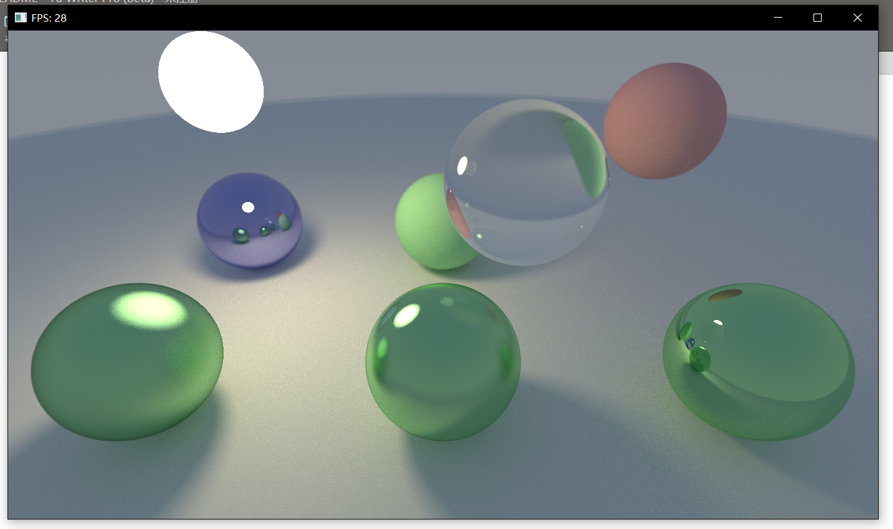

# GPU实现

---

## GLSL改写

CPU实现尽管用了多线程，但完全是由CPU进行计算的，而GPU有着强大很多的并行计算能力，正好目前对OpenGL比较熟悉，fragment shader可以对屏幕中每个像素进行并行计算，因此只需要把追踪的主要代码移植到fragment shader中就能实现OpenGL的光线追踪了。

主函数的代码很简单，就是普通的渲染一个全屏幕的quad，在shader中利用这个quad的屏幕坐标获得该像素对应的光线，进行追踪。

光线追踪的余下逻辑都在fragment shader中执行，因此那些结构体和函数也要在这里实现。由于不是实时渲染，需要对每一帧和上一帧的图像进行插值，我用了两个framebuffer交换绑定，将屏幕像素写入colorTexture，再在每次绘制时插值。

接下来要实现除相机外的所有结构体和方法。由于GLSL不支持struct的内置函数，结构体的方法只能单独写作函数；GLSL没有引用，但是有inout关键字可以达到同样的效果；GLSL也不支持递归调用，只能把`Trace()`函数改写为循环形式。这些改写基本都不需要改变代码逻辑，比较简单。

实现后，可以发现绘制的帧率比CPU快很多，画面更好：



### 随机数

实现中需要大量用到随机数，博客中用的是[Xorshift](https://en.wikipedia.org/wiki/Xorshift)随机数，据说是最快最常用的随机数算法，但是原理我看不懂。这里用于生成32位无符号整数伪随机数：

```cpp
static uint32_t XorShift32(uint32_t& state)
{
    uint32_t x = state;
    x ^= x << 13;
    x ^= x >> 17;
    x ^= x << 15; 
    state = x;
    return x;
}
```

由于这里要用的是float，需要把这个32位无符号整数转换为浮点数：

```cpp
float RandomFloat01(uint32_t& state)
{
    return (XorShift32(state) & 0xFFFFFF) / 16777216.0f;
}
```

这里&操作将32位无符号整数抹去前8位，而16777216就是2^24，即0xFFFFFF，因此再作除法就将整数转换为0-1的浮点数了。至于为什么要用16777216.0f，这里有个答案不知是否有关系[https://stackoverflow.com/questions/12596695/why-does-a-float-variable-stop-incrementing-at-16777216-in-c](https://stackoverflow.com/questions/12596695/why-does-a-float-variable-stop-incrementing-at-16777216-in-c)。

用0-1的float就可以生成高维随机数了：

```cpp
float3 RandomInUnitSphere(uint32_t& state)
{
    float3 p;
    do {
        p = 2.0*float3(RandomFloat01(state), RandomFloat01(state), RandomFloat01(state)) - float3(1, 1, 1);
    } while (p.sqLength() >= 1.0);
    return p;
}
```

这里博客用到的乘2再减单位向量也不知所云，运行结果和直接返回`float3(RandomFloat01(state), RandomFloat01(state), RandomFloat01(state))`并没有区别。

state的生成用的是：

```cpp
// cpu
uint32_t state = (y * 9781 + data.frameCount * 6271) | 1;
// d3d
uint state = uint(int(gl_FragCoord.x * 1973 + gl_FragCoord.y * 9277 + frameCount * 26699) | 1);
// my opengl
uint state = uint(int(gl_FragCoord.x * time * 9781 + gl_FragCoord.y * time * 6271) | 1);
```

如果只是为了每一帧每次的state都不同的话，这里的写法就有很多了，第三个就是用在这里的state生成代码。

### inoutRayCount

GPU实现里没有统计追踪光线的次数，因为GLSL的shader若想输出变量，就只能把输出值写入color texture中，没有全局共享的变量，这样若想把每个像素追踪到光线数输出，就要为framebuffer新建texture，再在每次绘制完成后把所有数值加起来得到总的光线数，有点繁琐，因此这里性能统计就只有帧率。

目前的GPU实现和CPU实现只是平台不同，但是之后的修改因为CPU运行太慢，只在这个GPU项目上修改。

---

## Fixing diffuse scattering

第一种材质的scatter光线方向应该是球面上随机一点，而非目前用的球内随机一点：



---

## Double lighting

若对于每个像素多次取样再平均，发现场景会变量，如下是对每个像素10次采样:



明显比1次要亮很多，说明光照计算有问题。这个问题是博客里提到的double lighting，采用了light sampling，也会有随机漫反射的光线也碰到了光源，因此发光体的光照会被重复计算。修改办法是若光线碰到了第一种材质Lambert，会在漫反射时额外追踪sample light，若漫反射光线也碰撞了光源，不再计算这次的emissive：

```cpp
if (!doMaterialE) matE = vec3(0.0);
doMaterialE = (mat.type != Lambert);
```

这一修改让画面有了大大的提升，没有那么亮，细节也更多了：



现在再对每个像素进行10次采样，画面也不会那么亮：



之前用的天空颜色是纯色，现在修改为和博客里一样的根据角度判断的天空颜色值，画面又有了很大提升，这次和博客的结果基本一致了：



---

## Mitsuba

[Mitsuba](http://www.mitsuba-renderer.org/)是一个PBRT渲染器，可以渲染出比较真实的效果，这里被拿来渲染一个相同的场景作为标准，博客中的double lighting就可以通过自己渲染和mitsuba渲染的结果对比发现。Mitsuba的场景文件是一个xml文件，把GPU实现的场景位置，材质等数据在文件中配置好，用Mitsuba就可以渲染了，得到结果如图：



和上一个截图对比，可以看到有一些小细节是不同的，比如大球体远处的边缘，GPU实现的结果有两个分界线；现在的阴影和灯光也不如Mitsuba渲染的柔和；第一排左一和左二的两个粗糙球体的结果也不太一样，左一的光晕很亮，左二的反射比较明显，这也有可能是我使用的参数不对。但是渲染的画面整体上已经比较接近“标准答案”了。

---

## AOS to SOA

SOA：sturuct of arrays，在结构体中对所有成员存储数组。与之相对的，常用的是AOS：array of structs，一个结构体所有实例的数组。改写为SOA就是将目前形如：

```cpp
struct Sphere
{
	vec3 center;
	float radius;
};
Sphere spheres[];
```

改写为：

```cpp
struct Spheres
{
    float centerX[];
    float centerY[];
    float centerZ[];
    float radius[];
};
```

这样可以在连续访问多个球体的半径时，在内存上移动更少的距离，因为这样的设计球体半径在内存上是连续的。这是一种实现SMID的结构体优化。

在实现SOA之前，先实验一个小改动。由于在计算时球体半径都要平方，所以在球体数据中直接存储半径的平方：

```cpp
struct Sphere
{
	vec3 center;
	float radiusSq;
};
```

在每个像素采样十次时，加上这个改进之前帧率在23左右，改写之后帧率上升到了27左右。

然后对球体结构体进行SOA改写：

```cpp
const SpheresSoA s_SpheresSoA = SpheresSoA
(
	vec3[](vec3(0,-100.5,-1), vec3(2,1,-1), vec3(0,0,-1), vec3(-2,0,-1), vec3(2,0,1), vec3(0,0,1), vec3(-2,0,1), vec3(0.5f,1,0.5f), vec3(-1.5f,1.5f,0.f)),
	float[](10000.0f, 0.25f, 0.25f, 0.25f, 0.25f, 0.25f, 0.25f, 0.25f, 0.09f)
);
```

把之前使用的每次判断一个球体碰撞的HitSphere改写为同时判断所有球体HitSpheres：

```cpp
int HitSpheres(const Ray r, const SpheresSoA spheres, float tMin, float tMax, inout Hit outHit)
{
	Hit tmpHit;
    int id = -1;
    float closest = tMax;
    for (int i = 0; i < kSphereCount; ++i)
    {
    // same as before
    }
    outHit = tmpHit;
    return id;
}
```

此时再运行，帧率上升到了34左右，提升很明显。

---